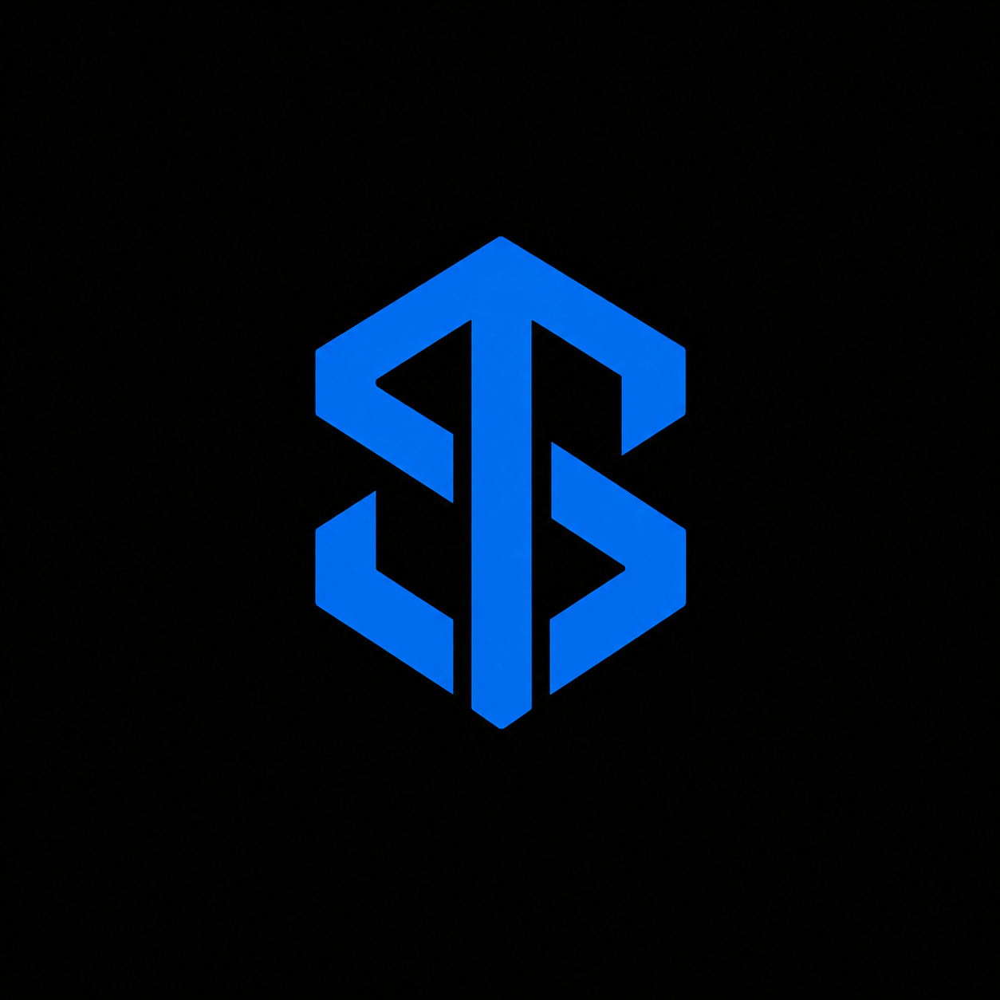

<div align="center">
  
  <h1>Sovereign-T</h1>
  <p><strong>A Premium, High-Security Digital Vault for the Modern Sovereign</strong></p>

  <p>
    
    
    
  </p>

  <hr />

  <h3>🚀 Instant Access</h3>
  <p>Skip the setup and experience Sovereign-T immediately:</p>
  <a href="https://github.com/GlytheHorizon/sovereign_t/tree/master/release" style="text-decoration:none;">
    
  </a>
  <p><small>Direct Download for Windows</small></p>

  <hr />
</div>

## 🛡️ About the Project

> [!IMPORTANT]
> **Sovereign-T** is my **2nd Windows application** project. It represents a significant leap in my desktop development journey, focusing on robust encryption and a premium user experience.
> 
> *Note: This repository primarily highlights the **Frontend** architecture and UI/UX patterns, as the core Rust backend is highly extensive.*

---

## ✨ Key Features

| Feature | Description |
| :--- | :--- |
| **Sovereign Security** | AES-256-GCM encryption with Argon2 key derivation. Your data never leaves your device. |
| **Modern UI/UX** | Stunning glassmorphism interface built with React, Tailwind CSS, and custom HSL palettes. |
| **Advanced Grouping** | Categorize accounts with custom colors and a powerful **Group Merging** engine. |
| **Security Dashboard** | Real-time health score, password strength analysis, and reuse detection. |
| **Mini-Vault** | A focused, compact mode for lightning-fast credential access. |
| **Smart Filtering** | Filter by email provider, username, or group with intelligent sorting. |

---

## 🛠️ Built With

<div align="center">
  <table>
    <tr>
      <td align="center" width="96">
        
        <br />React
      </td>
      <td align="center" width="96">
        
        <br />Rust
      </td>
      <td align="center" width="96">
        
        <br />TypeScript
      </td>
      <td align="center" width="96">
        
        <br />Tailwind
      </td>
      <td align="center" width="96">
        
        <br />Vite
      </td>
      <td align="center" width="96">
        
        <br />SQLite
      </td>
    </tr>
  </table>
</div>

---

## 🏗️ Developer Setup

### Prerequisites
- **Node.js** (v18+)
- **Rust** (Latest Stable)
- **Tauri CLI** (`npm install -g @tauri-apps/cli`)

### Installation
```bash
# 1. Clone the repository
git clone https://github.com/GlytheHorizon/sovereign_t.git

# 2. Enter directory
cd sovereign_t/frontend

# 3. Install dependencies
npm install

# 4. Launch in Dev Mode
npm run dev
```

---

## 📄 License & Credits

- **License**: Licensed under the [MIT License](LICENSE).
- **Author**: Created with ❤️ by **Jerwin Cruz (GlytheHorizon)**.

<div align="center">
  <p><i>Sovereign-T — Reclaiming your digital sovereignty, one password at a time.</i></p>
</div>
